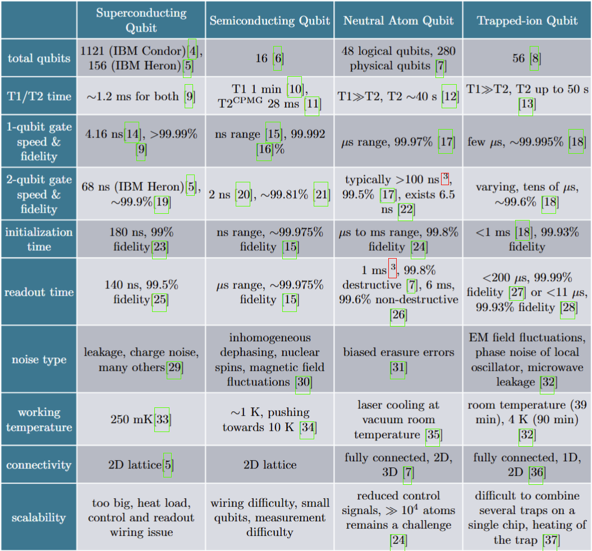

# Metrics-for-Different-Qubit-Types-under-QEC-2024

This is a report from course QIST4100 in Master programme Quantum Information Science and Technology from Delft University of Technology (TU Delft). 

In this report, we examine up-to-date(2024) metrics of popular qubit types (superconducting qubit, quantum dot, ion traps, neutral atoms, photonic qubit, bosonic qubit) that we consider essential in the Fault-Tolerent Quantum Computing(FTQC) era and discuss their own challenges to move towards the goal of FTQC. 

We created a table to compare different metrics for the first four qubits in our report. This handy table is also shown below. Please note that we choose state of the art performance for each metric, which might require certain experimental setup that is compatible with other performance metrics. 

 
 If you have any confusions or disagreement for the report/table, we welcome you to post issues in this repository.